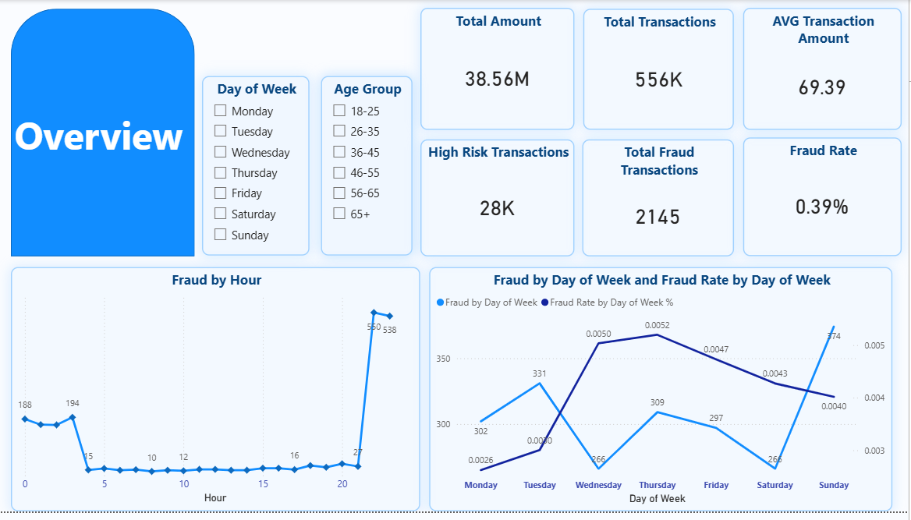
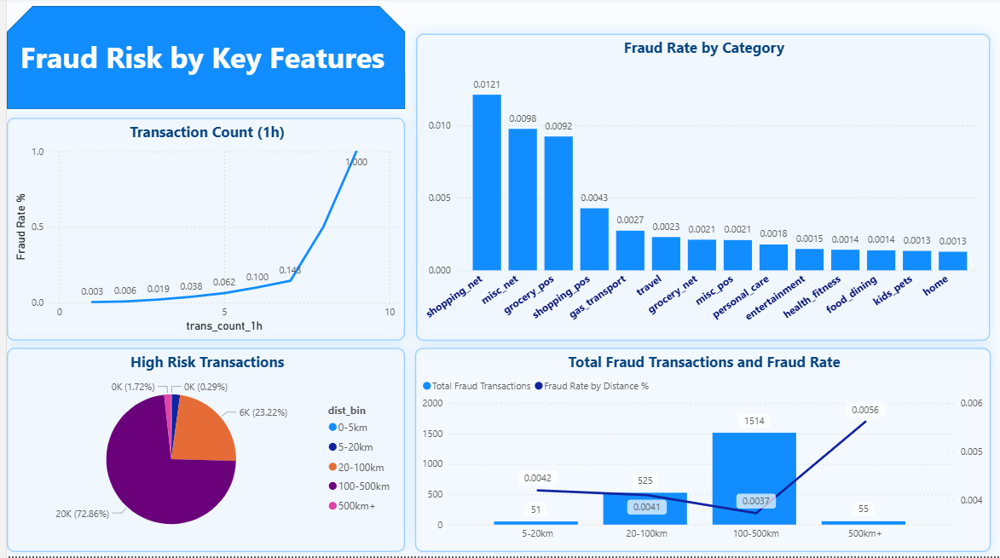

# fraud-detection-analysis
Fraud detection analysis using Python and Power BI, including machine learning models and business insights.
# Fraud Detection Analysis

## 📌 Overview
This project analyzes transaction data to detect fraudulent behavior using data analysis and machine learning techniques. Insights are visualized through Power BI to support business decision-making.

## 🎯 Objective
- Identify patterns of fraudulent transactions
- Build predictive models to detect fraud
- Provide actionable insights for risk management

## 🧠 Key Analysis

### 📅 Time-based Analysis
- Fraud rate varies significantly by hour of day
- Higher fraud activity observed during late-night periods
- Weekly patterns show certain days with elevated risk

### 👤 Customer Demographics
- Fraud distribution differs across age groups
- Certain age segments show higher vulnerability

### 🛒 Transaction Category
- Fraud is more concentrated in specific product categories

### 📍 Distance from Home
- Transactions occurring far from home location have higher fraud probability

### ⏱ Transaction Frequency
- High number of transactions within a short time (1 hour) strongly correlates with fraud

### 💰 Abnormal Transaction Amount
- Unusually large transactions show higher likelihood of fraud

---

## 🤖 Machine Learning Models

The following models were trained and compared:

- Logistic Regression
- Decision Tree
- Random Forest
- XGBoost
- LightGBM

### 📊 Model Insights
- Tree-based models (Random Forest, XGBoost, LightGBM) performed better in capturing complex fraud patterns
- Logistic Regression provides baseline interpretability
- Ensemble models improved detection performance

---

## 🛠 Tools Used
- Python (Pandas, Scikit-learn, Matplotlib)
- Power BI

---

## 📊 Dashboard

---

## 📈 Business Impact
These insights can help financial institutions:
- Detect suspicious transactions earlier
- Reduce financial losses due to fraud
- Improve monitoring systems and risk rules
- Enhance customer protection

---

## 📂 Project Structure
fraud-detection-analysis/
│
├── data/
├── powerbi/
├── images/
└── README.md
---

## 🚀 Skills Demonstrated
- Data cleaning & preprocessing
- Feature engineering
- Exploratory data analysis (EDA)
- Machine learning modeling
- Data visualization
- Business insight generation
